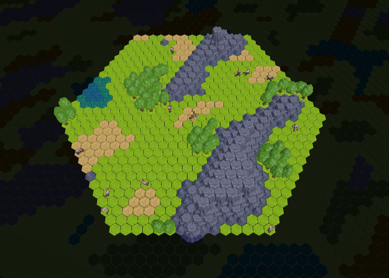

# CodeExample - Hex Grid Terrain Generation

A Unity demonstration project featuring a top-down axial hex grid system supporting 3,000,000 tiles with Perlin noise terrain generation and 10,000 independent agents with independent roaming.



## Technical Highlights
- **Multithreading using the Job System** - NPC system supporting a large number of individual agents
- **Hex Grid System** - Complete top-down hex grid implementation with cell navigation
- **A-Star Pathfinding** - Optimal route calculation across hex grid
- **Perlin Noise Generation** - Procedural terrain height and feature mapping
- **UI Toolkit** - Modern Unity UI system for clean, scalable interface design
- **Coroutine & Object Pooling** - Optimized generation of tile decoration for smooth performance
- **UI Toolkit and UGUI Integration** - Hybrid UI system combining modern Toolkit with legacy UGUI for maximum compatibility and flexibility

## How to Run the Build

### Windows Build
1. Download `WindowsBuild-Windows.zip` from the [Releases](https://github.com/83nyquist/CodeExample/releases) section
2. Extract the archive to a folder
3. Double-click `CodeExample.exe` to launch the game

### Linux Build
1. Download `LinuxBuild-Linux.zip` from the [Releases](https://github.com/83nyquist/CodeExample/releases) section
2. Extract the archive
3. Make the executable runnable:
   ```bash
   chmod +x CodeExample.x86_64
