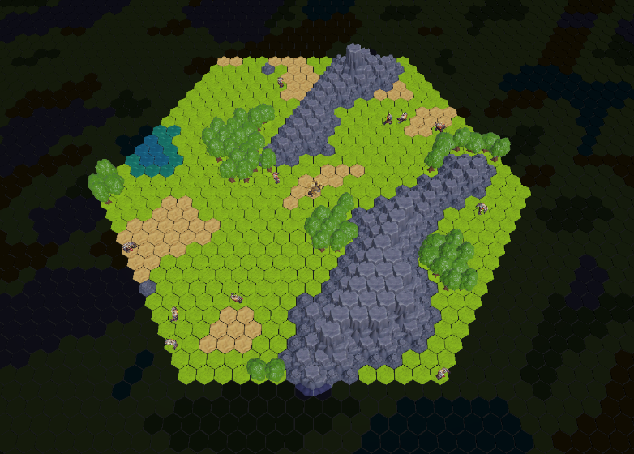

# CodeExample - Hex Grid Terrain Generation

A Unity demonstration project featuring a top-down axial hex grid system supporting 3,000,000 tiles with Perlin noise terrain generation and 10,000 independent agents with independent roaming.

## Technical Highlights
- **Multithreading using the Job System** - NPC system supporting a large number of individual agents (Systems/NPC)
- **Hex Grid System** - Complete top-down hex grid implementation with cell navigation (Systems/Grid)
- **A-Star Pathfinding** - Optimal route calculation across hex grid (Systems/Grid)
- **Perlin Noise Generation** - Procedural terrain height and feature mapping (Systems/Grid)
- **Coroutine & Object Pooling** - Optimized generation of tile decoration for smooth performance (Systems/Decorator)
- **Dependency Injection** - VContainer for service management and decoupling (Systems/DependencyInjection/BootloaderScope)
- **Event-Driven Architecture** - Centralized `GameEventBus` with source tracking for debugging (Systems/EventBus)
- **UI Toolkit and UGUI Integration** - Hybrid UI system combining modern Toolkit with legacy UGUI for maximum compatibility and flexibility (UserInterface)

## 🤖 AI-First Development (Upcoming)

To me, AI-First Development means the engineer acts as a **curator**—defining intent, architecture, and constraints—while AI agents handle implementation. The curator owns decisions, not keystrokes.

This project is **transitioning toward** an AI-First Development approach - a pragmatic code organization optimized for human-AI collaboration.

### What's Changing

**Current State (Traditional):**
- One class per file
- Systems spread across many small files
- Optimized for human navigation and merge conflicts

**Goal (Next Update):**
- Cohesive systems in single files (monoliths)
- Related classes live together (e.g., entire NPC system in `NpcSystem.cs`)
- Event definitions centralized in `GameEventBus.cs`
- Clear region separation using `// === SECTION ===` comments

### Why the Shift

When working with AI coding assistants, the limiting factor is **context window**. A system spread across 11 files requires the AI to read 11 separate files to understand the complete system. This is inefficient, token-expensive, and increases the chance of missed connections.

### When This Approach Works Well

| ✅ Good for | ❌ Not for |
| :--- | :--- |
| Small teams (1-3 developers) | Large teams (10+ developers) |
| AI-assisted development | Open source with many contributors |
| Rapid iteration and prototyping | Projects requiring strict merge workflows |
| Personal/solo projects | Enterprise with rigid coding standards |

### The Bottom Line

> *"Break the rules when the rules don't serve you."*

The next update will prioritize **AI collaboration efficiency** over traditional file organization. The code will be structured for machines (and AI) to read, not just for humans to navigate by filename.

*If you're a human reviewing this code: use your IDE's search. If you're AI: enjoy the full context.*
